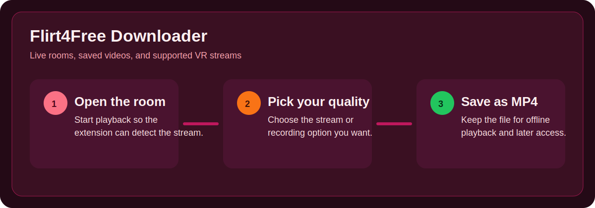

# Flirt4Free Downloader (Browser Extension)

> Record Flirt4Free live streams and download saved videos as MP4 files from your browser.

Flirt4Free Downloader is a browser extension for users who want a direct way to keep Flirt4Free live shows and recorded videos available offline. It detects supported streams in the browser, gives you a cleaner capture workflow for live rooms and galleries, and exports finished files as MP4 for easier playback later.

- Record active Flirt4Free live broadcasts while they are streaming
- Download saved videos from supported model gallery pages
- Preserve supported VR captures with playback-friendly metadata when available
- Choose from the stream qualities exposed on the page
- Save MP4 files for easier offline playback and archiving

## Links

- 🚀 Get it here: [Flirt4Free Downloader](https://serp.ly/flirt4free-video-downloader)
- 🆕 Latest release: [GitHub Releases](https://github.com/serpapps/flirt4free-downloader/releases/latest)
- ❓ Help center: [SERP Help](https://help.serp.co/en/)
- 🐛 Report bugs: [GitHub Issues](https://github.com/serpapps/flirt4free-downloader/issues)
- 💡 Request features: [Feature Requests](https://github.com/serpapps/flirt4free-downloader/issues)

## Preview

## Table of Contents

- [Why Flirt4Free Downloader](#why-flirt4free-downloader)
- [Features](#features)
- [How It Works](#how-it-works)
- [Step-by-Step Tutorial: How to Download Videos from Flirt4Free](#step-by-step-tutorial-how-to-download-videos-from-flirt4free)
- [Supported Formats](#supported-formats)
- [Who It's For](#who-its-for)
- [Common Use Cases](#common-use-cases)
- [Troubleshooting](#troubleshooting)
- [Trial & Access](#trial--access)
- [Installation Instructions](#installation-instructions)
- [FAQ](#faq)
- [Notes](#notes)
- [About Flirt4Free](#about-flirt4free)

## Why Flirt4Free Downloader

Flirt4Free is optimized for live viewing, not for keeping local copies of live sessions or saved clips. The platform uses streaming delivery that generic downloader extensions often fail to handle cleanly, and live content disappears once the show ends.

Flirt4Free Downloader is built specifically for that environment. It focuses on supported room and gallery pages, detects the active media in your browser session, and gives you a simpler way to keep accessible content locally without switching to desktop recording tools or manual stream inspection.

## Features

- Live stream recording for active Flirt4Free rooms
- Saved video downloads from supported gallery pages
- VR stream support when compatible media is exposed
- Quality selection for available resolutions and stream variants
- In-page controls on supported video pages
- Popup workflow for starting and managing captures
- Right-click access for a faster recording flow
- MP4 output for easier playback and transfer
- Automatic saving into a dedicated FLIRT4FREE folder
- Cross-browser support for Chrome, Edge, Brave, Opera, Firefox, Whale, and Yandex

## How It Works

1. Install the extension from the latest release.
2. Open Flirt4Free and go to a live room or saved video page.
3. Start playback so the extension can detect the stream.
4. Open the popup or use the on-page controls.
5. Choose the quality or stream option you want.
6. Record the live session or download the saved video.
7. Save the final MP4 file locally.

## Step-by-Step Tutorial: How to Download Videos from Flirt4Free

1. Install Flirt4Free Downloader from the latest GitHub release.
2. Open Flirt4Free and sign in if the page requires account access.
3. Visit the live room, gallery video, or supported VR page you want to keep.
4. Let the player load fully and press play.
5. Click the extension button or the on-page control.
6. Review the quality options shown by the extension.
7. For live rooms, start recording and stop it when the show is finished.
8. For saved videos, click download and wait for the MP4 export to complete.
9. Open the finished file from your Downloads folder.

## Supported Formats

- Input: Flirt4Free live streams
- Input: Flirt4Free saved videos
- Input: Supported Flirt4Free VR streams
- Output: MP4

Saved files use MP4 so they are easier to replay on standard media players, transfer between devices, or archive for later access.

## Who It's For

- Flirt4Free viewers who want to keep live rooms before they end
- Users who want offline access to saved gallery videos
- VR viewers who want to preserve supported immersive content
- People archiving content they are permitted to keep
- Anyone who wants a browser-based workflow instead of manual capture software

## Common Use Cases

- Record a Flirt4Free live broadcast to watch later
- Download a saved gallery video from a model page
- Keep local copies of content before it disappears from easy access
- Save supported VR content for later playback on compatible devices
- Download the best quality exposed by the page

## Troubleshooting

**The extension is not detecting the stream**  
Press play first and wait a few seconds so the stream has time to initialize.

**The page control is missing**  
Open the extension popup directly. Some supported pages work better through the popup UI.

**Only one quality option is listed**  
That usually means the page is exposing a single playable stream variant.

**The recording stopped too early**  
Check whether the live session ended or your internet connection dropped during capture.

**The page requires account or paid access**  
The extension only works on media you can already open and play in your active browser session.

## Trial & Access

- Includes **3 free downloads** so you can test the workflow first
- Email sign-in uses secure one-time password verification
- No credit card required for the trial
- Unlimited downloads are available with a paid license

Start here: [https://serp.ly/flirt4free-video-downloader](https://serp.ly/flirt4free-video-downloader)

## Installation Instructions

1. Open the latest release page:
   [https://github.com/serpapps/flirt4free-downloader/releases/latest](https://github.com/serpapps/flirt4free-downloader/releases/latest)
2. Download the extension build for your browser.
3. Install the extension.
4. Open Flirt4Free and navigate to a live room or saved video.
5. Use the extension controls to start recording or downloading.

## FAQ

**Can I record Flirt4Free live streams?**  
Yes. Active Flirt4Free live rooms can be recorded while they are broadcasting.

**Can I download saved videos too?**  
Yes. The extension supports saved Flirt4Free gallery videos on supported pages.

**Does it support VR streams?**  
Yes, when Flirt4Free exposes compatible VR-capable media for that page.

**What file format do downloads use?**  
Videos are saved as MP4 files.

**Where are videos saved?**  
They are saved to your default Downloads location, typically inside a FLIRT4FREE subfolder.

**Do I need extra software?**  
No. Everything runs through the browser extension.

## Notes

- Only download content you own or have explicit permission to save
- An internet connection is required for live capture and downloads
- Live recording only works while the creator is actively streaming
- Some pages may require account access, paid access, or membership
- VR support depends on the media exposed by Flirt4Free for that stream

## About Flirt4Free

Flirt4Free combines live cam rooms with saved video content, which makes offline access more awkward than on ordinary video platforms. Stream protection, page-specific playback behavior, and live-only access all add friction for users who want a local copy. Flirt4Free Downloader simplifies that workflow inside the browser for users who already have legitimate access to the content.
